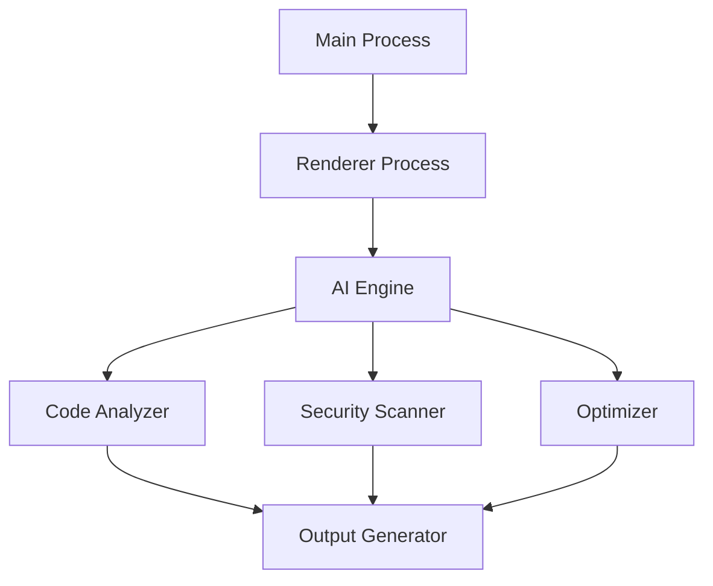

# Electron AI Packer 🚀

[](https://opensource.org/licenses/MIT)
[](https://github.com/amafjarkasi/electron-ai-packer/actions)
[](http://makeapullrequest.com)
[](https://github.com/amafjarkasi/electron-ai-packer/stargazers)
[](https://github.com/amafjarkasi/electron-ai-packer/issues)

**Electron AI Packer** is a cutting-edge desktop application that revolutionizes code repository management through AI-powered analysis and optimization. Built with Electron for seamless cross-platform compatibility, it offers developers an intuitive interface for handling complex codebases with ease.

## ✨ Key Highlights

- 🧠 **AI-Powered Code Analysis**: Leverage state-of-the-art AI models for deep code understanding
- 🖥️ **Cross-Platform Support**: Native experience on Windows, macOS, and Linux
- ⚙️ **Customizable Workflows**: Tailor the processing pipeline to your specific needs
- 🔍 **Comprehensive Code Insights**: Get detailed metrics and optimization suggestions
- 📦 **Efficient Packaging**: Create optimized code packages for deployment

## 🚀 Quick Start

Get up and running in minutes:

```bash
# Clone the repository
git clone https://github.com/amafjarkasi/electron-ai-packer.git

# Install dependencies
cd electron-ai-packer
npm install

# Start the application
npm start
```

## 🛠️ Core Features

### AI-Powered Analysis
- Code structure analysis
- Dependency mapping
- Code quality assessment
- Security vulnerability detection

### Repository Management
- Multi-repository support
- Version control integration
- Custom exclusion patterns
- File type recognition

### Output Generation
- Customizable templates
- Documentation generation
- Code summarization
- Export options (Markdown, HTML, PDF)

## 📊 System Architecture



## 🧩 Technology Stack

- **Frontend**: Electron, React
- **Backend**: Node.js
- **AI Engine**: TensorFlow.js, Natural Language Processing
- **Database**: SQLite (local storage)
- **Build Tools**: Webpack, Babel

## 📸 Screenshots

### Main Interface

*The main interface showing repository selection and basic controls*

### Processing Options

*Configuration panel with various processing options*

### Output Preview

*Real-time output preview during code processing*

## Configuration

### Processing Options
- **Max File Size**: Set maximum file size to process (default: 1MB)
- **Exclude Patterns**: List of file patterns to exclude
- **Remove Comments**: Strip comments from processed code
- **Security Checks**: Enable security vulnerability scanning
- **Custom Header**: Add custom documentation header

### AI Settings
- **Model Selection**: Choose between different AI models
- **Context Window**: Adjust AI context memory size
- **Temperature**: Control AI creativity level

## Troubleshooting

### Common Issues
**Slow Processing:**
- Reduce max file size
- Exclude large binary files
- Close other resource-intensive applications

**AI Output Quality:**
- Increase context window size
- Adjust temperature setting
- Provide more specific instructions

**Application Crashes:**
- Ensure you have the latest version
- Check system requirements
- Verify sufficient disk space

## 🤝 Contributing

We welcome contributions! Please see our [CONTRIBUTING.md](CONTRIBUTING.md) for guidelines.

## 📄 License

This project is licensed under the MIT License - see the [LICENSE](LICENSE) file for details.
