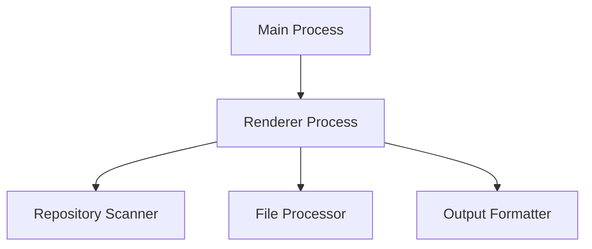
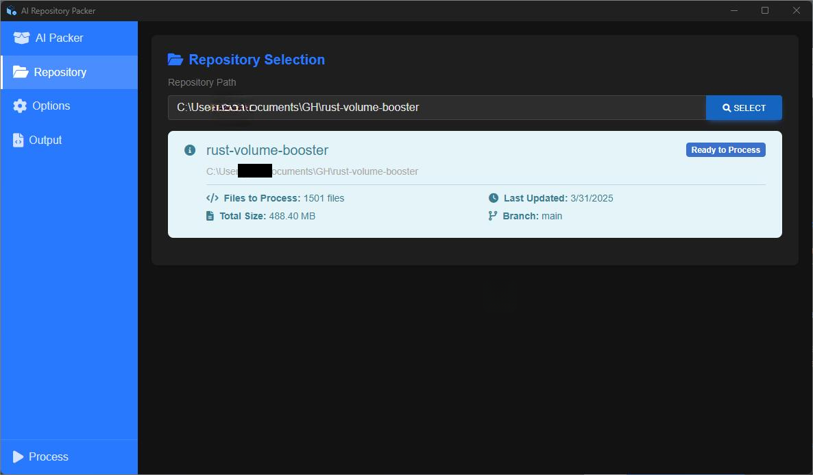

# Electron AI Packer

**Electron AI Packer** is a desktop application for processing and packaging code repositories into AI-friendly formats. Built with Electron for cross-platform compatibility, it provides an intuitive interface for managing repository processing tasks.

## ✨ Key Highlights

- 📂 **Repository Scanning**: Scans repositories to identify files, apply filters, and generate a directory structure.
- 🛠️ **File Processing**: Supports options like removing comments, removing empty lines, and performing security checks to sanitize files.
- 📜 **Output Formatting**: Formats processed repositories for various LLMs, including ChatGPT, Claude, and others.
- 🖥️ **User-Friendly Interface**: Provides an intuitive UI for selecting repositories, configuring options, and viewing/saving output.
- 🔍 **Customizable Options**: Allows users to set file size limits, exclude patterns, and add custom headers for output files.

## 🚀 Quick Start

Get up and running in minutes:

```bash
# Clone the repository
git clone https://github.com/amafjarkasi/electron-ai-packer.git

# Install dependencies
cd electron-ai-packer
npm install

# Start the application
npm start
```

## 🛠️ Core Features

### Repository Scanning
- Identifies files in the repository while respecting `.gitignore` and user-defined exclusion patterns.
- Generates a directory structure for better visualization.

### File Processing
- Removes comments and empty lines from code files.
- Performs security checks to redact sensitive information like API keys and private keys.
- Supports token counting for AI model compatibility.

### Output Formatting
- Formats processed files for different LLMs (e.g., ChatGPT, Claude, Perplexity, Gemini).
- Includes options for adding custom headers and repository descriptions.

### User Interface
- Simple navigation with tabs for repository selection, options configuration, and output viewing.
- Real-time progress updates during processing.
- Options to copy output to the clipboard or save it to a file.

## 📊 System Architecture



## 📸 Screenshots

### Main Interface

*The main interface showing repository selection and basic controls.*

### Processing Options

*Configuration panel with various processing options.*

### Repository Selection

*Interface for selecting and analyzing code repositories.*

### Output Preview

*Real-time output preview during code processing.*

## Configuration

### Processing Options
- **Max File Size**: Set maximum file size to process (default: 10MB).
- **Exclude Patterns**: List of file patterns to exclude.
- **Remove Comments**: Strip comments from processed code.
- **Security Checks**: Enable security vulnerability scanning.
- **Custom Header**: Add custom documentation header.

## Troubleshooting

### Common Issues
**Slow Processing:**
- Reduce max file size.
- Exclude large binary files.
- Close other resource-intensive applications.

**Application Crashes:**
- Ensure you have the latest version.
- Check system requirements.
- Verify sufficient disk space.

## 🤝 Contributing

We welcome contributions! Please see our [CONTRIBUTING.md](CONTRIBUTING.md) for guidelines.

## 📄 License

This project is licensed under the MIT License - see the [LICENSE](LICENSE) file for details.
